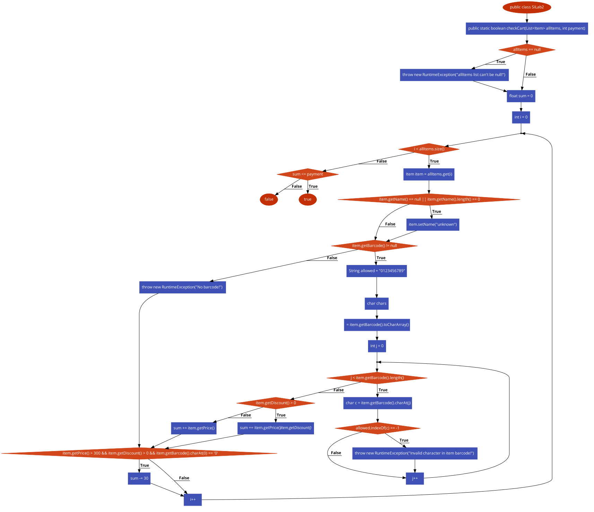

# SI_2024_lab2_204001

1. Викторија Унева
204001

2. 

3. Цикломатската комплексност

цк = Е - Н + 2П
Е = број на ребра
н = број на јазли
п = број на поврзани елементи 

ЦК= 27−23+2=6
До резултатот стигнав така што го изброив бројот на ребра и јазли. Ги одземав бројот на ребра со бројор на јазли и ги собрав со 2 * бројот на поврзани елементи.

4. Тест случаи според Every Branch критериум

-1. All items e null.(доколку allItems = null, треба да се фрли исклучок. "allItems list can't be null!")
-2. allItems празна низа []. (Порверува дали Bool = true; кога allItems e празна низа и сумата е 0).
-3.Артикал со важечки barcode и попуст.(Враќа true доклку сумата е помала од payment)
-4. Артикал со неважечки barcode.(Се очекува пораката: Invalid character in item barcode!,треба да фрли исклучок.)
-5. Артикал со непостоечки barcode.(Се очекува пораката: No barcode!,треба да фрли исклучок.)
-6. Проверува дали се добива 30 кога артиклот има цена поголема од 300, баркод кои започнува на бројот 0 и попуст.
-7. Сума која што е поголема од Paymentot. (Треба да врати false, Кога сумата на артиклите е поголема од paymentot.)

5. Напишете ги сите тест случаи според Multiple Condition критериумот за условот
if (item.getPrice() > 300 && item.getDiscount() > 0 && item.getBarcode().charAt(0)
== '0'). Напишете и објаснете ги тест случаите во документацијата. 

-Условите се исполенти. Доколку имаме артикал со цена 400, попуст 0.1 и barecode кој започнува на 0,  условот ќе биде исполнет = True.
- Доколку имаме цена помала од 300 , попуст 0.2  и barecode Кој започнува на 0 , условот нема да биде исполнет = false.
- Доколку артиклот е со цена 400, и имаме попуст 0, очекуваме false, затоа што попустот не го задоволува условот.
- Доколку баркодот не започнува на 0, Артикал со цена 410 и попуст 0.1, условот нема да биде задоволен затоа што баркодот не започнува на 0.
-Доколку имаме артикал со цена 420, попуст 0 и баркод кој започнува на 0, условот ќе биде исполнет затоа што не се одбива сумата.

6.

